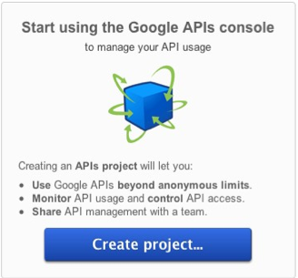
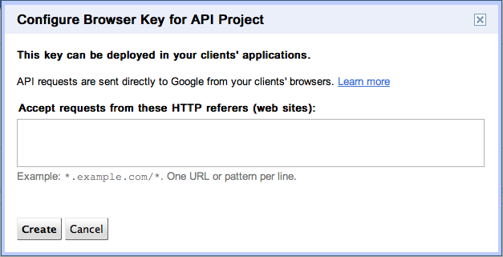
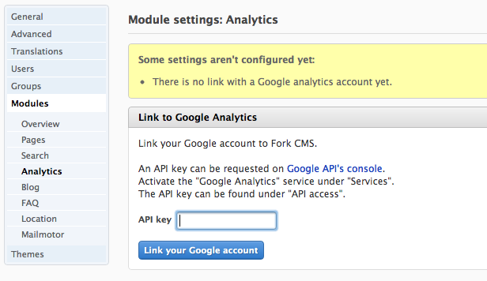
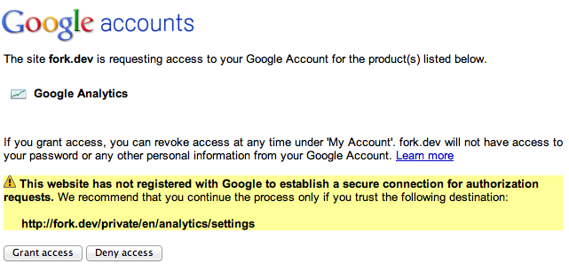
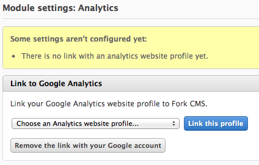

# Settings: Linking a Google Analytics account

The [analytics module](http://www.fork-cms.com/extensions/detail/analytics) requires you to link a Google Analytics account to Fork. This article will guide you through the process of setting up the analytics module.

## 1. Creating an API key

Go to the [Google API's console](https://code.google.com/apis/console/). If it is the first time, you will need to create a project.

Go to the *Services* page and activate the *Analytics API* by changing the status to "ON". You might need to agree with the terms of service.

After activating the service go the *API access* page. Under *Simple API Access* click on *Create new Browser key…*.

This will open up a dialog, asking you to specify which URL's can use this API key. Leave this empty, this will allow the API key to be used by any domain.

After creating, the API key will be available on the API Access page under "Simple API Access".

## 2. Link to the analytics module

Login in to your Fork and go to *Settings -> Modules -> Analytics*. You should see a text field asking you for an API key. Fill in the API key created in the previous step.

After clicking *Link your Google account*, you will be redirected to a Google accounts page asking you to grant access to your Google account. Click *Grant Access*.

After granting access you will be redirected back to Fork. You will now be asked to select a profile. This is the profile for which the analytics module will be fetch results.

Thats it! After linking a profile you will be able to see statistics in the analytics module.

